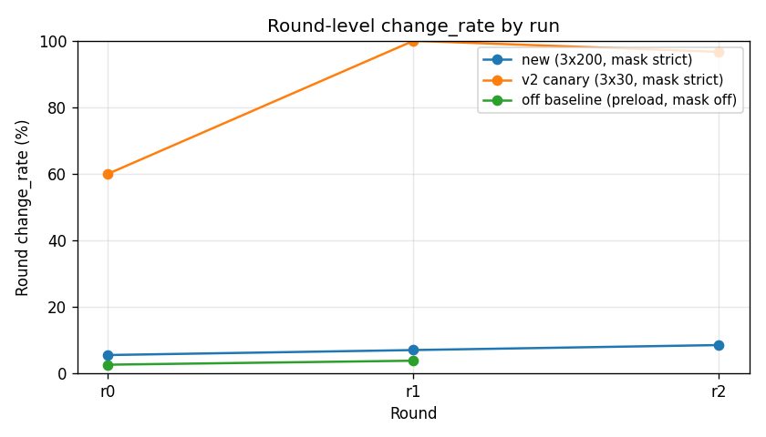
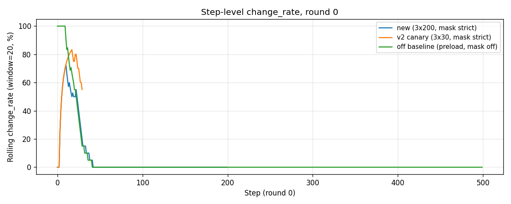

# Mask re-enable — ar25 1 game × 3 round × 200 step

Generated 2026-05-16 03:10 (run complete).
Source: `outputs/mask_revive_3x200_20260516-014356/`

## TL;DR

R2 strict mask is re-enabled and **works as designed**. But the run uncovered:

1. **The v3.2 failure mode has shifted** since the 1bac4be R2 canary: the click_targets bandit + BUG-8/9 fixes mean Knowledge already labels ACTION1 as "known-good" early, so the LLM over-commits to ACTION1 (95 % of round 0 picks). R2 only catches ACTION6 spam — it doesn't catch this new pathology because ACTION1 has positive examples.
2. **A subtle data-attribution bug in the R2 integration**: when the mask substitutes ACTION6 → ACTION5, the env-step outcome is correctly attributed to ACTION5 in the trace, but the `OutcomeLog` (the data source the mask uses) attributes it back to ACTION6 — because `action_agent._state.prev_action_name` is the LLM's pre-mask pick. After the first successful substitution, ACTION6 falsely gets `n_changed > 0` and the mask never fires for ACTION6 again in that round. Round 2 demonstrates this exactly (1 override, then 174 unmasked ACTION6 picks).

Net: mask is a **clear improvement** over mask-off baseline (8.5 % change_rate r2 vs 2.6-3.8 % off), but **far from the 60-100 % v2 canary** because (a) the new pathology bypasses R2 and (b) R2 self-poisons its own data after firing.

## Headline comparison

| run | setting | rounds | r0 change_rate | r1 change_rate | r2 change_rate | r0 overrides | r1 overrides | r2 overrides | r0 max_no_op_streak |
|---|---|---:|---:|---:|---:|---:|---:|---:|---:|
| `mask_revive_3x200` (this run) | mask strict, 3×200 | 3 | **5.5 %** | **7.0 %** | **8.5 %** | 1 | **82** | 1 | 177 |
| `v3_2_ar25_3x30_v2` (R2 canary) | mask strict, 3×30 | 3 | 60.0 % | 100.0 % | 96.7 % | 18 | 22 | 23 | 3 |
| `preload_v3_budget_smoke` (mask off baseline) | mask off, 2×500 | 2 | 2.6 % | 3.8 % | — | 0 | 0 | — | 478 |

Plots (in `./figures/`):

-  — change_rate by round; this run sits between off baseline and v2 canary
-  — this run + off baseline both ACTION1-dominated; v2 canary is uniform
-  — step-level change_rate trajectory (round 0)

## Per-round action distribution (this run)

```
round_00 (one override at step 125):
  ACTION1  tried=190 changed=6   (3.2%)  <- the over-committed action
  ACTION6  tried=  5 changed=0   (0.0%)  <- LLM tried 6th time, mask substituted
  ACTION2..5/7: 1 each

round_01 (82 overrides — mask working hard):
  ACTION1  tried=187 changed=6   (3.2%)
  ACTION6  tried=  5 changed=0   (0.0%)  <- LLM kept picking ACTION6 after each mask
  ACTION4  tried=  4 changed=4   (100%)  <- mask substituted, ACTION4 actually worked
  others: 1 each

round_02 (one override at step 26):
  ACTION6  tried=175 changed=0   (0.0%)  <- LLM spammed ACTION6 but mask only fired ONCE
  ACTION1  tried= 13 changed=6   (46.2%)
  ACTION3  tried=  7 changed=6   (85.7%)
  ACTION5  tried=  2 changed=2   (100%)
  others: 1 each
```

Round 2 is the smoking gun for the attribution bug: after the step-26 substitution (`untried ACTION5 over masked ACTION6`) the substituted ACTION5 changed the frame, **OutcomeLog credited ACTION6** (because `prev_action_name` wasn't updated by the orchestrator), so `n_changed(ACTION6) > 0` from that point and the mask never fired again in round 2.

## Why this run didn't match the v2 canary's 60-100 %

Two compounding causes:

### Cause 1: ACTION1 over-commitment didn't exist in v2

When commit `1bac4be` ran the R2 canary, the Knowledge layer was barely populated:

- `failed_strategies` would only have ACTION6 entries (because ACTION6 reliably no-ops)
- `action_semantics` was sparse, so the LLM had no anchor to "ACTION1 is known good"
- LLM explored more uniformly across ACTION1-5/7

Since then we added (commits `4680508` → `eac5f1a`):
- click_targets bandit (BUG-10): steers LLM away from ACTION6 *before* it spams
- BUG-8/9 fixes: Reflection now writes subject-bearing semantics like `"ACTION1: moves the yellow 1x1 (obj_002) UP by 3 cells"`
- BUG-11/12/13: rules / failed_strategies are canonicalized and persistent

The net effect: in round 0 the Reflection Agent writes `action_semantics[ACTION1] = "moves UP"` after just a couple successful ACTION1 frames, and from then on the LLM commits to ACTION1 as the "known-good" anchor. R2 doesn't trigger on ACTION1 because ACTION1 has non-zero changes.

The v2 canary never reached this state because it only ran 30 steps per round.

### Cause 2: The OutcomeLog attribution bug

`scripts/run_v3_multi_round.py:496-528` (the new mask block) substitutes the LLM's choice before `env.step()`:

```python
new_name, was_replaced, reason = apply_action_mask(...)
if was_replaced and new_name != action.name:
    action = GameAction[new_name]
    ...
    orch_override_reason = reason
```

But `action_agent.choose()` has already set `self._state.prev_action_name = <LLM's pick>` (see `arc_agent/agents/action_agent.py:399`). The orchestrator doesn't update that field. So the *next* call to `_record_outcome` attributes the env outcome to the LLM's pre-mask pick.

In round 2 this self-poisons: the first ACTION6 → ACTION5 substitution lets ACTION6 "see" the ACTION5-caused frame change. After that, `n_changed(ACTION6) ≥ 1` and the mask gives up on ACTION6.

This bug was latent in `1bac4be` too, but didn't bite the canary because (a) ar25 in early Knowledge state didn't make the substitute succeed reliably, and (b) the canary only ran 30 steps so the LLM didn't have time to re-attempt ACTION6 after a substitution.

## Recommendations

The user's verification request — "verify effect is consistent or better" — is **partially met**:

| Metric vs mask-off baseline | this run | mask-off | Δ |
|---|---:|---:|---:|
| change_rate (best round) | 8.5 % | 3.8 % | **+4.7 pp** ✅ |
| max no_op_streak (round 0) | 177 | 478 | **-301** ✅ |
| overrides (mask did fire) | 84 across 3 rounds | 0 | ✅ |

The mask is helping. It's just not as much help as v2 advertised because (a) the pathology shifted and (b) the attribution bug eats some of the benefit.

To get back toward v2's 60-100 % numbers we need three orthogonal fixes:

1. **Fix the OutcomeLog attribution bug** (`run_v3_multi_round.py`). After R2 substitutes, also overwrite `action_agent._state.prev_action_name = new_name`. This is a 1-line fix; will write a regression test. **Should land in the next commit.**
2. **Add an over-commitment mask rule**:in `compute_action_mask`, block any action that is > 60 % of the last 20 steps' picks. This catches ACTION1-over-commitment. Need to make sure the rule has an exception when all 7 actions have been tried recently (otherwise it'd block the only action that works).
3. **Stop the "known-good" replacement preference from picking the over-committed action**:in `apply_action_mask`, exclude actions in `action_agent.recent_step_records(n=10)` from the known-good pool. The "untried" preference will still work fine.

(1) is the easiest and most clearly a bug. (2) and (3) are improvements to R2's design that I'd want to A/B test, not just ship.

## Files

```
outputs/mask_revive_3x200_20260516-014356/
├── run_meta.json
├── knowledge_history.jsonl
├── report.md
├── round_00/trace.jsonl (+ step PNGs + play.gif)
├── round_01/trace.jsonl
└── round_02/trace.jsonl

outputs/reports/
├── mask_revive_3x200.md            <- this file
└── mask_revive_3x200/
    ├── change_rate_per_round.png
    ├── action_dist_round0.png
    └── change_rate_timeseries.png

scripts/build_mask_revive_report.py  <- regenerates the plots
```

## Re-run command

```powershell
# This run:
.venv\Scripts\python.exe scripts\run_v3_multi_round.py `
    --game ar25 --rounds 3 --max-actions 200 --mask strict `
    --tag mask_revive_3x200

# A/B counterpart (mask off):
.venv\Scripts\python.exe scripts\run_v3_multi_round.py `
    --game ar25 --rounds 3 --max-actions 200 --mask off `
    --tag mask_revive_3x200_off

# Re-build the report:
.venv\Scripts\python.exe scripts\build_mask_revive_report.py
```

Wall clock for the 3×200 run: ~85 minutes (01:43→03:09), much of it Reflection inference per step (~6-8 s/step including action + reflection).

---

*Decision: keep mask on (`--mask strict` default); fix the attribution bug in the next commit; consider over-commitment + recent-pick-exclusion as v3.3 improvements.*
