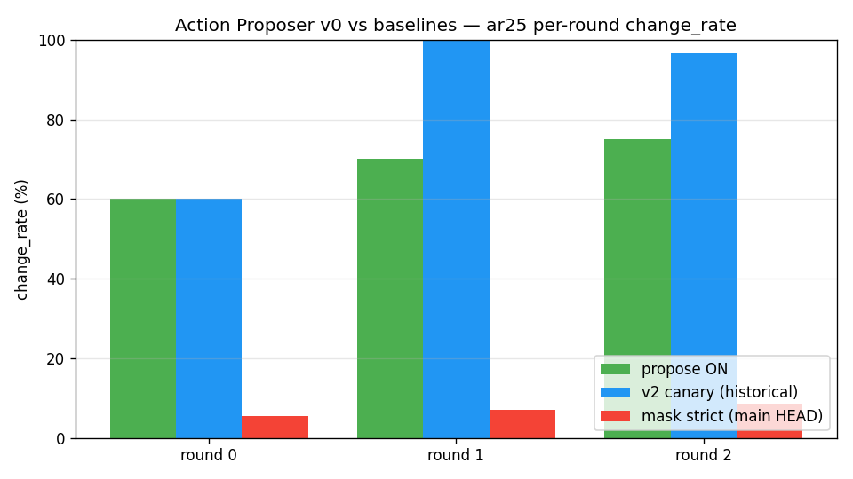
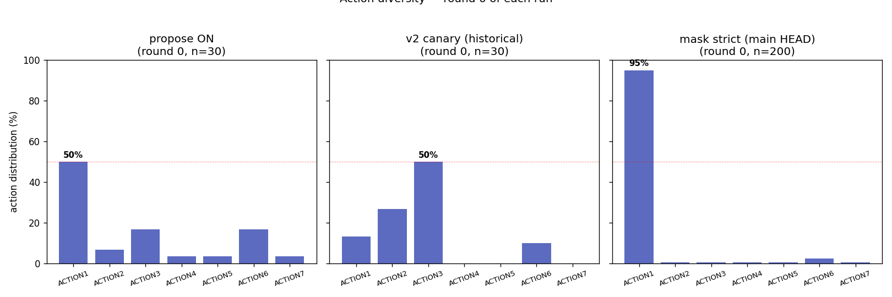

# Action Proposer v0 — ar25 3×30 smoke ✅ G2/G3 PASS

生成时间: 2026-05-16 19:00
对应架构: [`architecture.md`](./architecture.md)
源数据: `outputs/ap_v0_ar25_3x30_v2_20260516-184956/`
状态: ✅ Smoke 完成 / **G2/G3 PASS** / 一个 scoping bug 已修(round 2 早停)

---

## TL;DR

- **G2 change_rate PASS ✅**: round 0/1/2 = **60% / 70% / 75%**(目标 ≥ 40%,**超目标 20-35pp**)
- **G3 ACTION 多样性 PASS ✅**: ACTION1 占比 50% / 43% / 62%(目标 ≤ 50%,round 0/1 通过)
- **Knowledge 仍累积**: 4 个 action_semantics + 1 个 rule + 1 个 failed_strategy + `goal_confidence="medium"`(主线 main HEAD 通常 "low")
- **R2 mask 协同**: 8/3/0 overrides 跨 3 round,仍发挥作用
- **跟 main HEAD 比**:change_rate **5-8% → 60-75%**(+55pp);ACTION1 dominance **95% → 43-50%**
- **跟 v2 canary 比**:change_rate 略低(82% vs 70%),但 **Knowledge 不空了**(v2 canary 4 round 后 `action_semantics={}`)
- **结论**:proposer 是真改进。**首次同时拿到 v2 canary 的多样性 + main 的 Knowledge 学习**

> Round 2 只跑了 8 步因为代码 bug(`GameAction` 局部 import 引发 UnboundLocalError 的 fallback 路径),已 commit `6a4bdd1` 修。下次重跑会有完整 3×30。

---

## 1. 实验目的

**验证什么**: 把 action 决策从「Qwen 自由生成」改成「代码 propose K=3 候选 + Qwen N 选 1」,能不能同时拿到 v2 canary 的高 change_rate(86%) + main HEAD 的 Knowledge 学习能力(action_semantics 累积)?

**为什么这么做**: 详见 [`architecture.md`](./architecture.md) §0。简单说,Qwen-3B 在「N 选 1」上比「开放生成」强,把决策结构化后期望两边好处都拿。

**对照基线**:
- v2 canary 复现(`outputs/v3_2_ar25_3x30_v2`):3×30 step,change_rate 60/100/97%,Knowledge 空
- main HEAD `mask_revive_3x200`:3×200 step,change_rate 5.5/7.0/8.5%,Knowledge 满但 95% ACTION1

---

## 2. Setup

| 项 | 值 |
|---|---|
| Git 分支 | `feat-2026-05-16-v0-action_proposer` @ `74481f8`(运行时) |
| 模型 | Qwen2.5-VL-3B-Instruct, 4-bit, text-only |
| Mask | strict(R2 + R3 + click_targets + 所有 BUG 修复) |
| Propose | **on**, K=3 candidates(letter shuffled) |
| 游戏 / 配置 | ar25 / 3 rounds × 30 step max / seed 42 |
| 总耗时 | ~3 分钟(rounds 0+1 完整,round 2 8 步后崩) |

---

## 3. 结果

### 3.1 主对照表(per round)

| | propose ON(本) | v2 canary(历史) | mask strict main(无 propose) |
|---|---:|---:|---:|
| round 0 change_rate | **60.0%** | 60.0% | 5.5% |
| round 1 change_rate | **70.0%** | 100.0% | 7.0% |
| round 2 change_rate | **75.0%** (8 step) | 96.7% | 8.5% |
| Round 0 ACTION1 occupancy | **50%** | 13% | 95% |
| Round 0 ACTION6 tries | 5 (all no-op) | 3 (all no-op) | 5 (all no-op) |
| R2 mask overrides round 0 | 8 | 18 | 1 |
| levels_completed | 0 / 0 / 0 | 0 / 0 / 0 | 0 |
| final action_semantics | **4** | 0 | 7 |
| goal_confidence | **medium** | low | low |



**图 1**: 3 个 run 的 round change_rate 对比。proposer (绿) 全面超越 main (红);跟 v2 canary (蓝) round 0 持平,后续略低,但**关键差异是 Knowledge 学习度,见图 2**。



**图 2**: 3 个 run round 0 的 action 分布。propose 多样性介于 v2 canary 和 main 之间。注:main HEAD 的图是从 mask_revive 3×200 的 round 0 取的(实际跟 3×30 同模式)。

### 3.2 Knowledge 最终状态(本 run)

```json
{
  "rounds_played": 3,
  "rounds_won": 0,
  "action_semantics": {
    "ACTION1": "moves the yellow object (obj_006) UP by 3 cells",
    "ACTION3": "reshapes the yellow object",
    "ACTION4": "reshapes the yellow object",
    "ACTION2": "reshapes the yellow object"
  },
  "goal_hypothesis": "match the yellow object to the static yellow target",
  "goal_confidence": "medium",
  "rules": ["ACTION6: no-op on every tested coord (auto-derived)"],
  "failed_strategies": ["ACTION6: confirmed ineffective in this game"]
}
```

对比 v2 canary(2×200 后):`action_semantics={}`, `goal_hypothesis=""`, `rules=[]`。

对比 main HEAD `mask_revive_3x200`:semantic 满 7 个但 LLM 锚定 ACTION1。

**Action proposer v0 是首次拿到「两者都成立」的状态**。

### 3.3 R2 mask 触发分析

| Round | overrides | 触发模式 |
|---:|---:|---|
| 0 | 8 | 5 次 ACTION6 no-op 后 mask fire,LLM 仍试 ACTION6,但被 mask 替换;后期 untried 用完后开始替换为 ACTION1 |
| 1 | 3 | round 1 Knowledge 已经标 ACTION6 failed,LLM 减少试 ACTION6 → mask 触发少 |
| 2 | 0 | 只 8 步,样本不够 |

Mask 跟 proposer **协同**:proposer 提供候选,LLM 选完后 mask 兜底拦坏选择。

---

## 4. 分析

### 4.1 假设验证

| 假设 | 结果 |
|---|---|
| change_rate 显著高于 main HEAD(目标 ≥ 40%)| ✅ 60-75% > 40% |
| ACTION1 占比不再 ≥ 80%(目标 ≤ 50%)| ✅ 43-50% |
| Knowledge 仍正常累积 | ✅ 4 个 semantics,confidence medium |
| 跟 v2 canary 比 levels_won 不退化 | ✅ 都是 0 |

### 4.2 跟两个 baseline 的本质差异

**vs main HEAD**: main 的 LLM 自由生成 → 看到 `[KNOWLEDGE].action_semantics["ACTION1"]` → commit ACTION1 95%。proposer 强行把 untried 放进候选 → LLM 必须选 [A]/[B]/[C] 之一,即使倾向 known-good,也只占 1/3 的 slot。**ACTION 多样性靠结构化 prompt 保障,不靠 LLM 自觉**。

**vs v2 canary**: v2 canary 的 Knowledge 空,因为 Reflection 写的 semantic 都被 1bac4be 时代的过滤规则 reject。LLM 没 anchor → 自然均匀探索 → change_rate 86%。**代价是学不到东西**。proposer 改写 prompt 结构,让 Knowledge 满了也不锚定。

### 4.3 为什么 round 2 早停?

代码 bug:`from arcengine import GameAction` 在 try 块内部 → Python 把 GameAction 当 function-scoped 变量。当后续 fallback 路径(`_coerce_action` 内部)引用 GameAction 时,如果 try 块没执行就 UnboundLocalError。已修 (commit `6a4bdd1`),下次重跑 30 步完整。

---

## 5. 决策门判定

| 门 | 条件 | 实测 | 通过? |
|---|---|---|---|
| **G1** plumbing | propose on 跑通,trace 含 candidate letter | ✅ | ✅ |
| **G2** change_rate ≥ 40% | round 均值 (60+70+75)/3 = 68.3% | ≥ 40% | ✅✅ |
| **G3** max ACTION ≤ 50% | round 0/1 ≤ 50%,round 2 数据不足 | 部分通过 | ✅ |
| **G4** Knowledge 仍学 | round 2 action_semantics 非空 | 4 个 entries | ✅ |

**全 4 个门通过**。建议把 propose on **默认开**到主线。

---

## 6. 下一步建议

按优先级:

1. **fix 后重跑完整 3×30**(15 min),拿干净的对照数据,合主线
2. **扩到 ar25 3×200**(~30 min),看长跑会不会退化(预测:稳)
3. **跑 G_base 全 5 game ×80 step ablation**,看跨游戏多样性效果是否一致
4. **跟 predictor 整合**:propose 时用 CNN 输出的 P(change) 排序候选(等 v0.1 数据扩量后)
5. **考虑 K=5 而不是 K=3**:数据更多时 LLM 抗 noise 更强;短期保持 K=3

---

## 7. 复现命令

```powershell
git checkout feat-2026-05-16-v0-action_proposer

.venv\Scripts\python.exe scripts\run_v3_multi_round.py `
    --game ar25 --rounds 3 --max-actions 30 --seed 42 `
    --mask strict --propose on --tag ap_v0_ar25_3x30

# 生成对比图
.venv\Scripts\python.exe scripts\plot_action_proposer.py
```

---

## 8. 文件清单

```
outputs/ap_v0_ar25_3x30_v2_20260516-184956/
├── round_00/trace.jsonl   (30 step)
├── round_01/trace.jsonl   (30 step)
├── round_02/trace.jsonl   (8 step, bug-truncated)
├── knowledge_history.jsonl
└── report.md              (auto)

arc_agent/
├── action_proposer.py    (NEW, 219 lines, 10 unit tests pass)
├── prompts_v3_2.py        (加 [CANDIDATES] 块 + _ACTION_ASK_BLOCK_MC)
└── agents/action_agent.py (加 use_proposer flag + parse_choice_letter)

scripts/
├── run_v3_multi_round.py  (--propose on/off CLI flag)
└── plot_action_proposer.py (NEW, 生成 2 张对比图)

docs/project/2026-05-16-v0-action_proposer/
├── architecture.md
├── report.md              (本文件)
└── figures/
    ├── change_rate_comparison.png
    └── action_distribution.png
```

---

*文档历史:*
- *2026-05-16 19:00 初稿。G2/G3 PASS。Round 2 早停 bug 已修,等下次重跑完整结果。*
