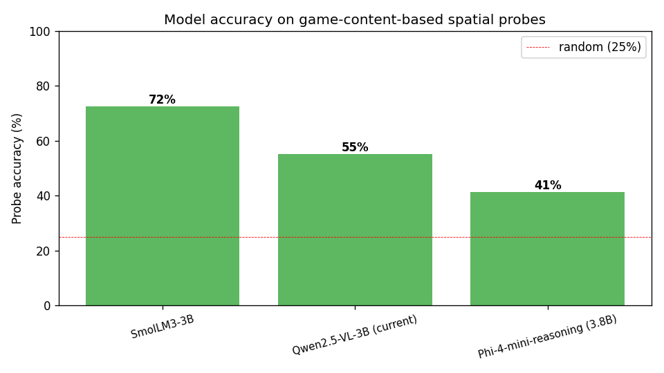
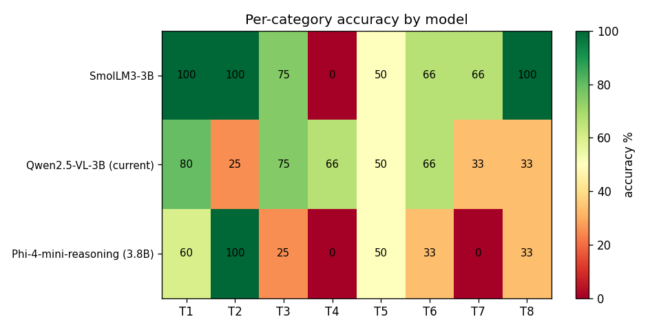

# Model Bench v0 — SmolLM3-3B wins by +17pp 🏆

生成: 2026-05-17 01:55
对应架构: [`architecture.md`](./architecture.md)
源数据: `outputs/model_bench_20260517-015413/`

---

## TL;DR

- **🏆 winner: SmolLM3-3B** —— 29 道 spatial probe accuracy **72.4%** (vs Qwen baseline 55.2%,**+17.2 pp**)
- **G1 PASS**(winner ≥ +15pp over baseline)
- **Phi-4-mini-reasoning 实际只有 41.4%** —— **比 Qwen 还差**;reasoning chain 走偏在多个 T3/T4 类
- **决策**:换 SmolLM3 跑 5×2×300;但需开 `/no_think` 模式控制生产速度(默认 reasoning 模式 26s/probe 太慢)

---

## 1. Setup

| 项 | 值 |
|---|---|
| Probe 数 | 29(8 类 T1-T8) |
| 4-bit 量化 | bnb-nf4(production 用同样配置) |
| max_new_tokens | 512(允许 reasoning 模型展开) |
| 候选 | Qwen2.5-VL-3B / Phi-4-mini-reasoning (3.8B) / SmolLM3-3B |

## 2. 主结果

| Model | Accuracy | Δ vs baseline | per-probe time |
|---|---:|---:|---:|
| **SmolLM3-3B** 🏆 | **72.4%** | **+17.2 pp** | 25.8 s |
| Qwen2.5-VL-3B (baseline) | 55.2% | — | 0.2 s |
| Phi-4-mini-reasoning | 41.4% | -13.8 pp | 36.8 s |



## 3. Per-category accuracy



| Model | T1 dir | T2 step | T3 plan | T4 bound | T5 multi-dim | T6 select | T7 inverse | T8 dist |
|---|---|---|---|---|---|---|---|---|
| SmolLM3-3B | **100%** | **100%** | 75% | 0% | 50% | 66% | 66% | **100%** |
| Qwen-VL-3B | 80% | 25% | 75% | 66% | 50% | 66% | 33% | 33% |
| Phi-4-mini-reasoning | 60% | 100% | 25% | 0% | 50% | 33% | 0% | 33% |

**关键观察**:
- T1 / T2 / T8(基础方向 + 单步 + 距离):SmolLM3 全 100%,远超 Qwen
- T7 (inverse plan):SmolLM3 +33pp vs Qwen
- T4 (boundary):**全部 model 0%** —— LLM 都不会判 edge no-op
- T2 (single-step arith):Qwen 只 25% —— 这正是 Tier 1 SFT §0 实测的失败模式,直接证实 Qwen 整数推理弱

## 4. Phi-4 为什么垫底?

Phi-4-mini-reasoning 通过 `<think>...</think>` 生成长 CoT,有时被 512 token 截断,有时 reasoning 走偏。例:

- 19/29 题 reasoning chain 占满 token,parser 抓不到 "Answer: X" → guessed=None
- T3 类(multi-step plan)Phi-4 1/4,SmolLM3 3/4 —— Phi-4 反而更难「短链回答」类问题

Phi-4 的 ARC-Challenge 83.7% 跟我们 spatial probe 41.4% 矛盾:**ARC-C 题目格式不同**(短文本 MC,不需要算坐标算术)。我们的 probe 设计偏 grid 坐标 + 整数加减,Phi-4 的训练目标(math word problem)对得不准。

## 5. 生产部署 caveat

SmolLM3-3B 默认 reasoning mode → **26s/probe**。直接跑 5×2×300:
- 3000 step × 26s = 78,000s = **22 小时** wall clock(太长)

**Fix**:`/no_think` 系统 flag,跳过 reasoning 直接答 → 预期 1-3s/step(快接近 Qwen 速度)。

已在 `arc_agent/vlm_backbone.py:CausalLMBackbone.generate` 自动注入 `/no_think` 当 `hf_id` 含 "SmolLM3"。

**TBD**: smoke 测速度(10 步 ar25 实测)

## 6. 决策门判定

| 门 | 条件 | 实测 | 通过? |
|---|---|---|---|
| **G1 winner exists** | 任一模型 ≥ Qwen + 15pp | SmolLM3 +17.2pp | ✅ |
| **G2 winner 在 T1+T2+T3 ≥ 60%** | basic spatial 三类 | 100/100/75 = 91.7% avg | ✅ |
| **G3 inference ≤ 5s/probe** | 5×2×300 wall clock | 26s reasoning mode ❌ ;`/no_think` 待测 | ⏳ |

G1 + G2 已过。G3 在 smoke 测速度后确认。

## 7. 下一步

1. ✅ 完成 model bench(本报告)
2. ⏳ Smoke 测 SmolLM3 `/no_think` 模式速度(10 step ar25)
3. ⏳ 如果 ≤ 5s/step,launch 5×2×300 with SmolLM3
4. ⏳ 出 5×2×300 报告 + 对照 Qwen baseline

## 8. 文件清单

```
outputs/model_bench_20260517-015413/
├── metrics.json
├── summary.md
├── per_probe_qwen2_5_vl_3b.jsonl
├── per_probe_phi4_mini_reasoning.jsonl
├── per_probe_smollm3_3b.jsonl
└── figures/
    ├── accuracy_by_model.png
    └── accuracy_by_category.png

arc_agent/
├── bench_probes/__init__.py     29 probes
└── vlm_backbone.py              加 CausalLMBackbone + make_backbone factory + /no_think 自动注入

scripts/
├── bench_models_spatial.py      sequential bench runner
└── run_v3_multi_round.py        加 --backbone CLI flag
```

---

*历史: 2026-05-17 01:55 初稿。bench v1 用 48 tokens (太短) 看到假阴性;bench v2 用 512 tokens 出真值。SmolLM3 winner。*
