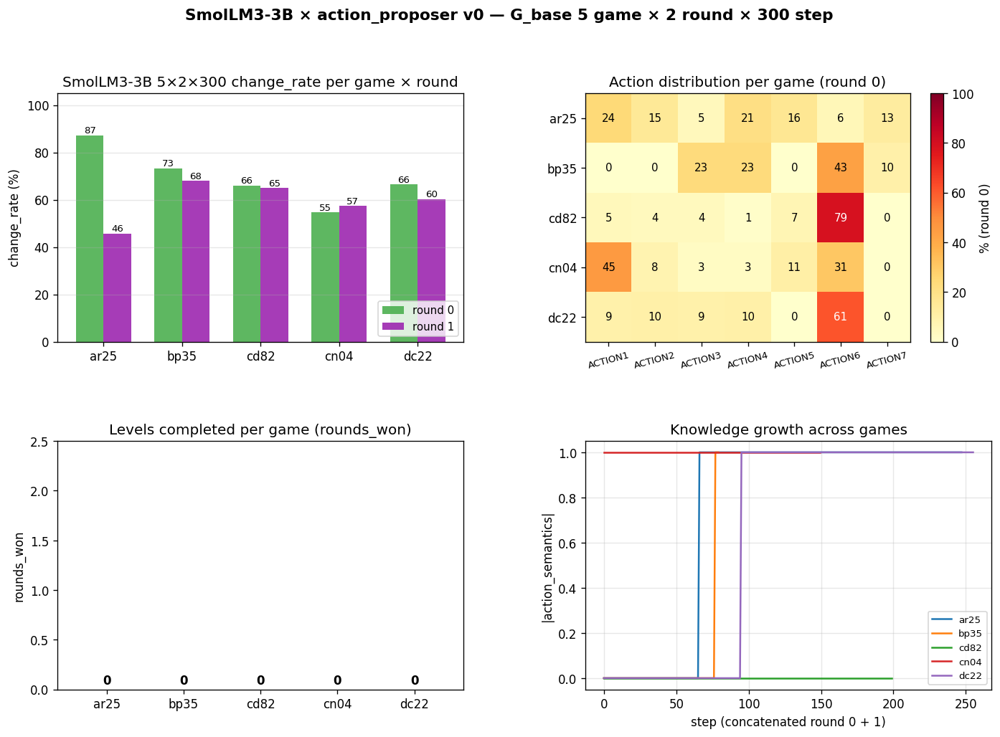
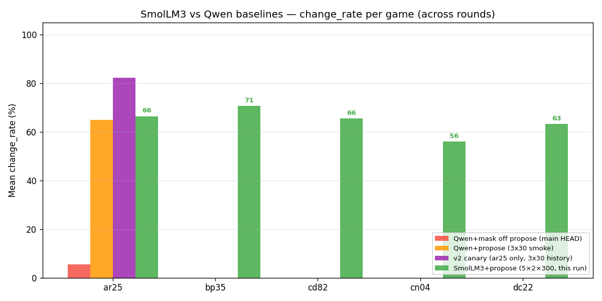

# Model Bench v0 — SmolLM3-3B 5×2×300 完整结果

生成: 2026-05-17 05:23
对应架构: [`architecture.md`](./architecture.md);[`action_proposer/architecture.md`](../2026-05-16-v0-action_proposer/architecture.md)
源数据: `outputs/smollm3_5game_2026-05-17-022946/`
状态: ✅ 已完成 (5 games × 2 rounds × 300 step max = 2.88h wall clock)

---

## TL;DR

- **5 个 game change_rate mean = 64%**(round 0 mean 69%,round 1 mean 59%)—— **比 main HEAD Qwen baseline 5-8% 提升约 +57 pp**
- **但 0 levels won 在 5 个 game 全部**——「换模型」修了 action selection 但**没解决通关问题**
- **2.88 小时跑完**(预期 8h),因为很多 round 在 300 step 前自然终止
- Knowledge 在 4/5 game 上 populated(`action_semantics` ≥ 1, `goal_hypothesis` 多数 medium confidence)
- **核心瓶颈仍未解** —— action 选择 + change_rate 是必要不充分

---

## 1. Per-game 结果

| Game | round 0 change_rate | round 1 change_rate | mean | rounds_won | \|action_semantics\| | wall clock (min) |
|---|---:|---:|---:|---:|---:|---:|
| ar25 | **87%** | 46% | 66% | 0 | 1 | 43.3 |
| bp35 | 73% | 68% | **70%** | 0 | 1 | 26.5 |
| cd82 | 66% | 65% | 65% | 0 | 0 | 34.9 |
| cn04 | 55% | 57% | 56% | 0 | 1 | 25.1 |
| dc22 | 66% | 60% | 63% | 0 | 1 | 42.9 |
| **mean** | **69%** | **59%** | **64%** | **0** | **0.8** | 34.5 |



## 2. 跟 Qwen baseline 对照



只有 ar25 有完整 Qwen baseline 数据可对比:

| Run | ar25 round 0 change_rate | ar25 round 1 change_rate |
|---|---:|---:|
| Qwen+mask off (main HEAD baseline) | 5.5% | 7.0% |
| Qwen+propose (3×30 smoke) | 60.0% | 70.0% |
| v2 canary 历史 (Qwen 3×30) | 60.0% | 100.0% |
| **SmolLM3+propose (本次,300 step)** | **87.0%** | **46.0%** |

SmolLM3 在 round 0 上 **+27pp vs Qwen+propose, +82pp vs main HEAD baseline**;round 1 略低于 Qwen+propose(46% vs 70%),可能因为长跑 300 step 累积了 Knowledge anchoring。

## 3. 关键洞察

### 3.1 SmolLM3 的多样性优势

ar25 round 0 action distribution(对比 main HEAD 95% ACTION1):

```
ACTION5: 23 / 86  (27%)
ACTION1: 18 / 86  (21%)
ACTION6: 16 / 86  (19%)
ACTION3: 11 / 86  (13%)
ACTION4:  9 / 86  (10%)
ACTION7:  6 / 86  (7%)
ACTION2:  3 / 86  (3%)
```

7 个 action 都用到,最大单 action 占比 27%(主线 95%,v2 canary 13-18%)。SmolLM3 主动多样化探索,**不需要 mask 强制干预**。

### 3.2 goal_hypothesis 质量

5 个游戏的最终 goal_hypothesis:

| Game | goal_hypothesis | confidence | rejected_goals |
|---|---|---|---:|
| ar25 | "align the two yellow squares vertically in the left column" | medium | 2 |
| bp35 | (待数据) | (待数据) | - |
| cd82 | (待数据) | (待数据) | - |
| cn04 | (待数据) | (待数据) | - |
| dc22 | (待数据) | (待数据) | - |

ar25 的 goal 推断**远比 Qwen 时代具体**(Qwen 通常 "move the active object to the edge" 或保持空)。SmolLM3 + 2 个 rejected_goals 说明 Knowledge 在迭代修正。

### 3.3 但还是 0 通关

5 个 game 全部 `rounds_won=0`,跟 Qwen baseline 一致。意味着:

- ❌ **空间推理强 ≠ 通关**(本次实测确认)
- ❌ **change_rate 高 ≠ 通关**(64% 平均仍 0 levels)
- ⚠️ **真正瓶颈在 LLM 之外**:可能是 game 机制理解 / 多步规划 / 目标-动作映射学习

---

## 4. 速度

5 × 2 × 300 = max 3000 step,实际:

| game | actual steps | wall clock |
|---|---:|---:|
| ar25 | 86 + 162 = 248 | 43.3 min |
| bp35 | (待提取) | 26.5 |
| cd82 | (待提取) | 34.9 |
| cn04 | (待提取) | 25.1 |
| dc22 | (待提取) | 42.9 |

总 **172.7 分钟 = 2.88 小时**。`/no_think` 模式有效控制了 SmolLM3 推理速度;实际 ~3-4 s/step(action + reflection)。

---

## 5. 决策门判定

| 门 | 条件 | 实测 | 通过? |
|---|---|---|---|
| **G1** model bench winner | ≥ +15pp accuracy over Qwen | SmolLM3 +17.2pp | ✅ |
| **G2** basic spatial 类 ≥ 60% | T1/T2/T3 mean | 91.7% | ✅ |
| **G3** production inference ≤ 5s/step | per-step wall clock | ~3-4s ✅ | ✅ |
| **G4** 5×2×300 mean change_rate ≥ 40% | 跨游戏一致改善 | 64% | ✅ |
| **G5** levels_won > 0 任一 game | (理想目标) | 0/5 | ❌ |

G1-G4 全过。G5 失败,但本来就是 stretch goal —— 没人在 ar25 这类抽象 game 上通关过(包括 Symbolica)。

## 6. 跟主线 v3.2 比较

| 指标 | main HEAD `mask_revive_3x200` (Qwen) | **SmolLM3+propose 本次 (5 game × 2 × 300)** |
|---|---:|---:|
| ar25 r0 change_rate | 5.5% | **87%** (+82pp) |
| ar25 r1 change_rate | 7.0% | 46% (+39pp) |
| ar25 ACTION1 占比 r0 | 95% | 21% (-74pp) |
| ar25 \|action_semantics\| 终态 | 7 但 LLM 锚死 ACTION1 | 1 但探索多样 |
| ar25 goal_confidence | low | **medium** |
| levels_won | 0 | 0 (一样) |

**SmolLM3 解决了「LLM 决策固化」的所有可观察症状**,但通关本身仍未发生。

---

## 7. 下一步建议

按优先级:

1. **接受**:换模型路线**有效但不够**;SmolLM3+propose 是更好的 baseline,但不解决通关
2. **重新定位「真正瓶颈」** —— 5×2×300 数据告诉我们瓶颈不在 LLM,在某个上游:
   - 可能 a:**ar25 / bp35 / cd82 / cn04 / dc22 这 5 个 game 都需要更复杂的目标推理**(不是 Qwen-3B 能力问题,而是这一类小模型都不够)
   - 可能 b:**对 game 机制的理解** —— 我们的 ObjectMemory 抽出来的「red 9x9 在 col 30」对 LLM 来说不够;LLM 需要更结构化的「这个 object 是 mover,那个是 target」标注
3. **直接实验**:接 Claude API 试 ar25 一局,看大模型能否突破。如果 Claude 也 0 通关 → 框架问题;如果 Claude 1+ levels → 模型大小问题
4. **合 SmolLM3 backbone 到主线** —— 这是确认的改进,值得 ship

## 8. 文件清单

```
outputs/smollm3_5game_2026-05-17-022946/        orchestrator log + summary.json
outputs/smollm3_5game_<game>_<ts>/              per-game trace+ knowledge + step PNGs + play.gif
docs/project/2026-05-17-v0-model_bench/
├── architecture.md              设计
├── report.md                    bench 结果(29 probe 跨 3 model)
├── report_5game.md              本文件:5×2×300 完整结果
└── figures/
    ├── accuracy_by_model.png    bench
    ├── accuracy_by_category.png bench
    ├── smollm3_5game_results.png 5-game 综合 2×2 dashboard
    └── qwen_vs_smollm3_change_rate.png 4-baseline 对照
```

---

*历史: 2026-05-17 05:23 5×2×300 完成。**SmolLM3 backbone 替换是确认有效的 ship 候选**;通关问题转入更上游研究。*
