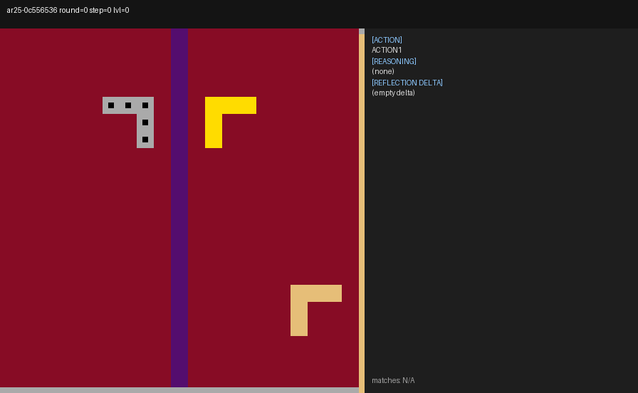
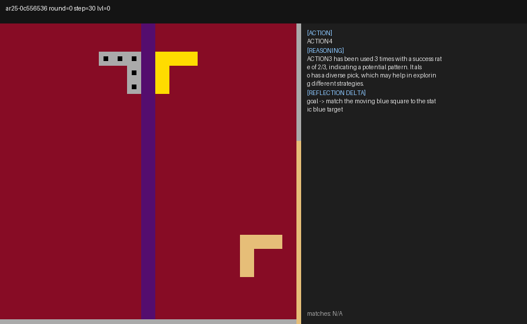
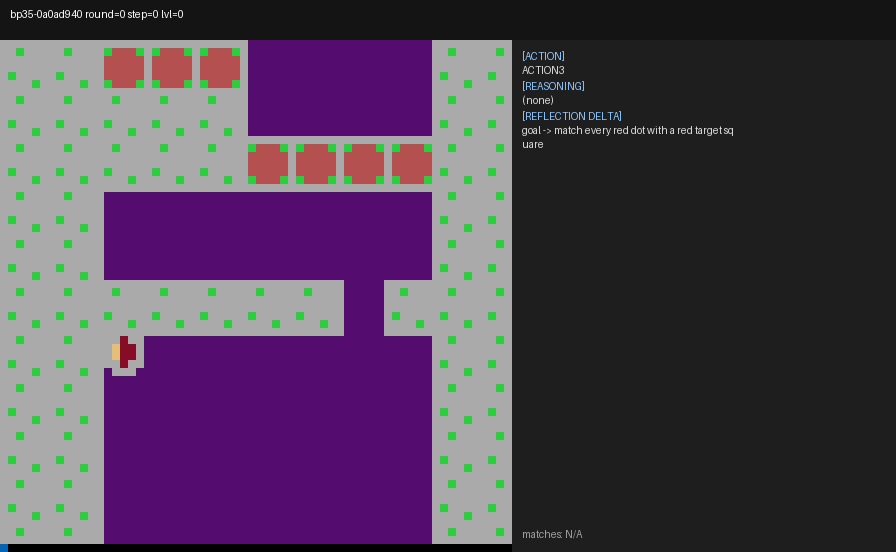
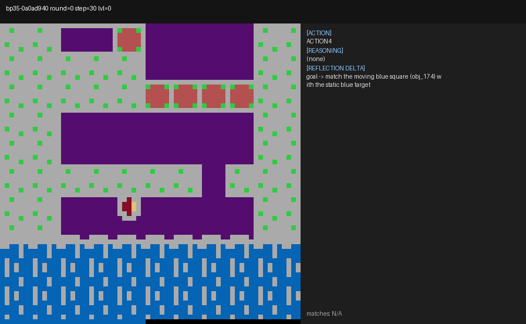
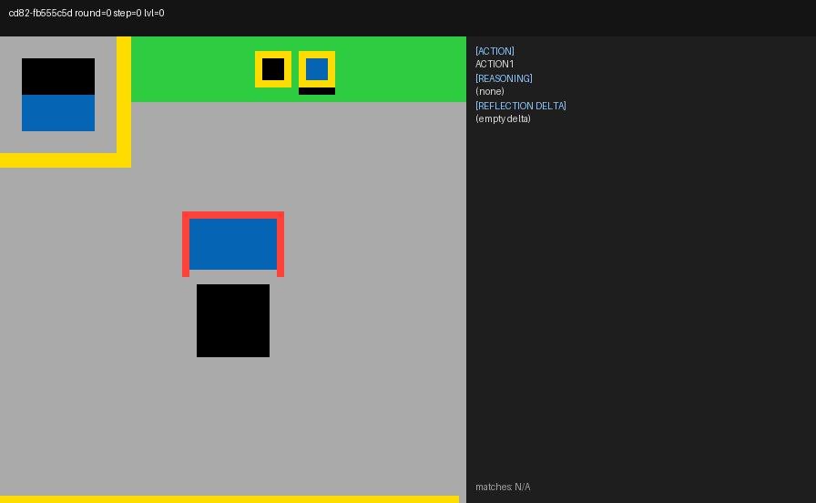
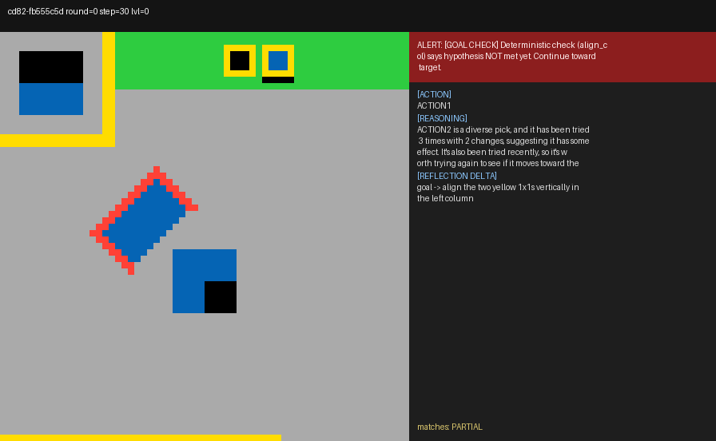
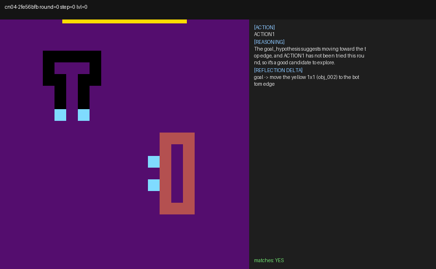
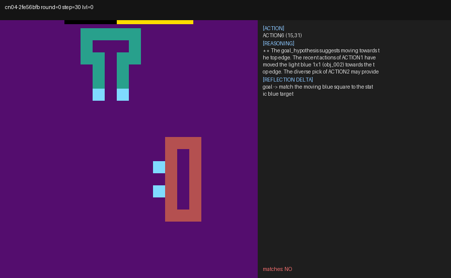
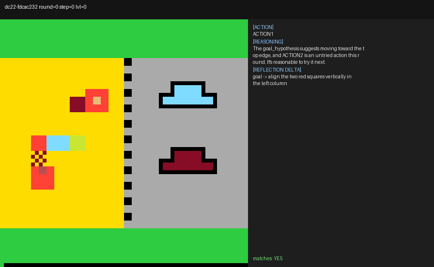
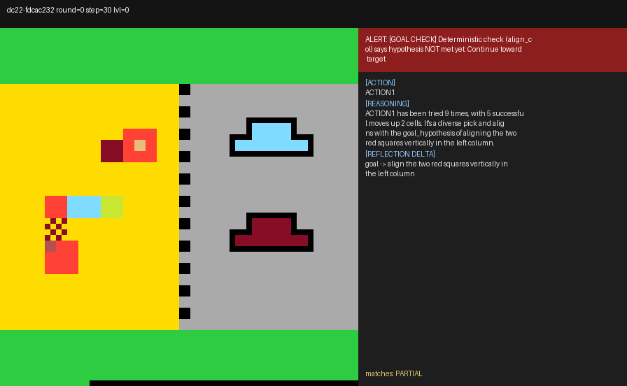

# T-DISCOVER bench — Annotation Form

> Generated by `scripts/bench_goal_gen.py` on 20260529-141709. Edit this file in
> place: for every (game, frame, hypothesis_k) row, fill in the
> **label** column with one of `YES`, `PARTIAL`, `NO`, or `UNSURE`.
> Optional: edit `proposed_ground_truth` to your own best guess.
>
> When done, run:
>
>     .venv/Scripts/python.exe scripts/bench_goal_gen_score.py
>
> to produce charts + summary.

## Labels meaning

- **YES** — hypothesis describes the real win condition (or close enough
  that an agent acting on it would tend to win).
- **PARTIAL** — captures part of the goal but misses details / names
  wrong objects / is too vague.
- **NO** — wrong target, hallucinated entities, or action-described
  rather than state-described.
- **UNSURE** — you cannot judge without more info.


---

## ar25 — frame A_zero_prior (step 0)



**Proposed ground truth (you can override below)**:

> match / align the gray objects with their same-color targets (heuristic best-guess — verify by play)

```
your_corrected_ground_truth: 
```


### K=5 hypotheses

| k | hypothesis | label (YES/PARTIAL/NO/UNSURE) |
|---:|---|---|
| 0 | align the two tan objects vertically in the left column | **____** |
| 1 | (parse failed) | **____** |
| 2 | Align the two gray objects vertically in the left column | **____** |
| 3 | align the 9x9_size45 objects vertically in the left column | **____** |
| 4 | align the two gray objects (objects #1 and #2) vertically in the left column | **____** |

---

## ar25 — frame B_with_prior (step 30)



**Proposed ground truth (you can override below)**:

> match / align the gray objects with their same-color targets (heuristic best-guess — verify by play)

```
your_corrected_ground_truth: 
```


### K=5 hypotheses

| k | hypothesis | label (YES/PARTIAL/NO/UNSURE) |
|---:|---|---|
| 0 | match the moving yellow 1x1 (obj_000) with the static yellow target | **____** |
| 1 | (parse failed) | **____** |
| 2 | Match the tan 7 and 8. | **____** |
| 3 | (parse failed) | **____** |
| 4 | (parse failed) | **____** |

---

## bp35 — frame A_zero_prior (step 0)



**Proposed ground truth (you can override below)**:

> match / align the green objects with their same-color targets (heuristic best-guess — verify by play)

```
your_corrected_ground_truth: 
```


### K=5 hypotheses

| k | hypothesis | label (YES/PARTIAL/NO/UNSURE) |
|---:|---|---|
| 0 | align the purple 5x5 blocks in the left column | **____** |
| 1 | (parse failed) | **____** |
| 2 | align all red objects vertically in the left column | **____** |
| 3 | match every yellow object with its corresponding static target | **____** |
| 4 | align the two purple squares vertically in the left column | **____** |

---

## bp35 — frame B_with_prior (step 30)



**Proposed ground truth (you can override below)**:

> match / align the green objects with their same-color targets (heuristic best-guess — verify by play)

```
your_corrected_ground_truth: 
```


### K=5 hypotheses

| k | hypothesis | label (YES/PARTIAL/NO/UNSURE) |
|---:|---|---|
| 0 | align all green objects vertically in the left column | **____** |
| 1 | (parse failed) | **____** |
| 2 | align each purple object with a corresponding static purple target | **____** |
| 3 | (parse failed) | **____** |
| 4 | match the purple objects (the ones at #214 and #215) by aligning them horizontally | **____** |

---

## cd82 — frame A_zero_prior (step 0)



**Proposed ground truth (you can override below)**:

> match / align the yellow objects with their same-color targets (heuristic best-guess — verify by play)

```
your_corrected_ground_truth: 
```


### K=5 hypotheses

| k | hypothesis | label (YES/PARTIAL/NO/UNSURE) |
|---:|---|---|
| 0 | align the navy group objects 8,9,10 vertically in the center of the board | **____** |
| 1 | align all yellow objects in the left column | **____** |
| 2 | (parse failed) | **____** |
| 3 | align the navy group with the moving blue square at the bottom edge | **____** |
| 4 | align each yellow group with their respective targets | **____** |

---

## cd82 — frame B_with_prior (step 30)



**Proposed ground truth (you can override below)**:

> match / align the yellow objects with their same-color targets (heuristic best-guess — verify by play)

```
your_corrected_ground_truth: 
```


### K=5 hypotheses

| k | hypothesis | label (YES/PARTIAL/NO/UNSURE) |
|---:|---|---|
| 0 | (parse failed) | **____** |
| 1 | (parse failed) | **____** |
| 2 | move the two yellow 1x1s (obj_001 and obj_000) to the bottom edge of the board | **____** |
| 3 | (parse failed) | **____** |
| 4 | (parse failed) | **____** |

---

## cn04 — frame A_zero_prior (step 0)



**Proposed ground truth (you can override below)**:

> match / align the light blue objects with their same-color targets (heuristic best-guess — verify by play)

```
your_corrected_ground_truth: 
```


### K=5 hypotheses

| k | hypothesis | label (YES/PARTIAL/NO/UNSURE) |
|---:|---|---|
| 0 | (parse failed) | **____** |
| 1 | align the four light blue objects vertically in the left column | **____** |
| 2 | match the moving yellow 1x1 with the static yellow target | **____** |
| 3 | align the purple same-color group | **____** |
| 4 | align all the same-color groups vertically in the left column | **____** |

---

## cn04 — frame B_with_prior (step 30)



**Proposed ground truth (you can override below)**:

> match / align the light blue objects with their same-color targets (heuristic best-guess — verify by play)

```
your_corrected_ground_truth: 
```


### K=5 hypotheses

| k | hypothesis | label (YES/PARTIAL/NO/UNSURE) |
|---:|---|---|
| 0 | (parse failed) | **____** |
| 1 | move the moving blue square (ACTION5) to the static blue target | **____** |
| 2 | (parse failed) | **____** |
| 3 | (parse failed) | **____** |
| 4 | align the two light blue 3x3_size9 objects in the center | **____** |

---

## dc22 — frame A_zero_prior (step 0)



**Proposed ground truth (you can override below)**:

> match / align the maroon objects with their same-color targets (heuristic best-guess — verify by play)

```
your_corrected_ground_truth: 
```


### K=5 hypotheses

| k | hypothesis | label (YES/PARTIAL/NO/UNSURE) |
|---:|---|---|
| 0 | Every yellow object must reach the bottom edge of the board | **____** |
| 1 | every yellow object must reach the bottom edge | **____** |
| 2 | every yellow object must reach the bottom edge | **____** |
| 3 | align the yellow objects at the bottom edge | **____** |
| 4 | align the 4x4_size16 block to the center of the grid to help align the same-color groups | **____** |

---

## dc22 — frame B_with_prior (step 30)



**Proposed ground truth (you can override below)**:

> match / align the maroon objects with their same-color targets (heuristic best-guess — verify by play)

```
your_corrected_ground_truth: 
```


### K=5 hypotheses

| k | hypothesis | label (YES/PARTIAL/NO/UNSURE) |
|---:|---|---|
| 0 | align the two red squares vertically in the left column | **____** |
| 1 | (parse failed) | **____** |
| 2 | (parse failed) | **____** |
| 3 | (parse failed) | **____** |
| 4 | align the two red squares vertically in the left column | **____** |