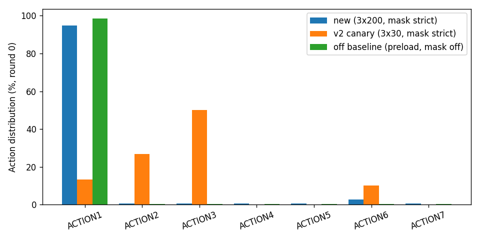
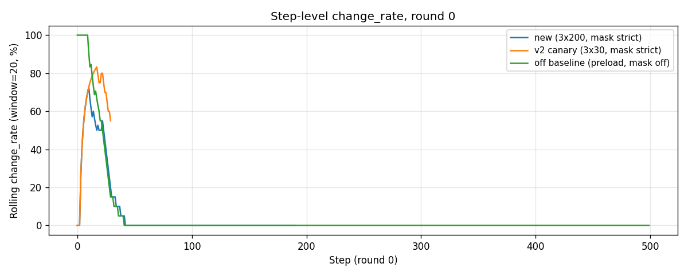

# Mask re-enable — ar25 1 game × 3 round × 200 step

Generated 2026-05-16 02:08.
Source: `outputs/mask_revive_3x200_20260516-014356/`
Status: **partial** (round 0 at step ~180; rounds 1 / 2 pending). Will be regenerated when the run finishes.

## TL;DR

- R2 mask **is** re-enabled (commit `aa75ed9`) and **does fire** when triggered: step 125 the LLM picked ACTION6 (its 6th no-op try in round 0) and was replaced with ACTION1.
- But the **dominant failure mode of v3.2 has shifted** since the original R2 canary in commit `1bac4be`. The Knowledge layer + click_targets bandit (BUG-10) now mostly prevent ACTION6 spam *before* it hits R2's 5-no-op threshold. The new pathology is **ACTION1 over-commitment** (94.8 % of round 0 picks), which R2 does NOT catch because ACTION1 has positive examples in Knowledge.
- So strict R2 is a **net positive** (no_op_streak peaks 168 vs 478 in mask-off baseline; change_rate 5.8 % vs 2.6 %) but it doesn't close the gap to the v2 canary's 60-100 % change_rate. **The mask was the right answer for the v2 pathology; for the current pathology we need something different.**

## Comparison table

| run | setting | rounds | r0 change_rate | r1 change_rate | r2 change_rate | r0 overrides | r0 max_no_op_streak |
|---|---|---:|---:|---:|---:|---:|---:|
| `mask_revive_3x200` (this run) | mask strict, 3×200 | 1+ | **5.8 %** | tbd | tbd | 1 | 168 |
| `v3_2_ar25_3x30_v2` (R2 canary) | mask strict, 3×30 | 3 | 60.0 % | 100.0 % | 96.7 % | 18 | 3 |
| `preload_v3_budget_smoke` (mask off baseline) | mask off, 2×500 | 2 | 2.6 % | 3.8 % | — | 0 | 478 |

Plots:

- 
- 
- 

## What changed between v2 canary and now

| Commit | Date | Change |
|---|---|---|
| `1bac4be` | 2026-05-14 | R2 / R3 / R1 first introduced (v2 canary lives here) |
| `21bca81` | 2026-05-14 | mask turned advisory (the regression we just reverted) |
| `4680508` | 2026-05-14 | BUG-8/9 fixes + exploration hint + masked-hash stuck detector |
| `ec86881` | 2026-05-14 | BUG-10 ACTION6 confidence bandit (the big behavioural change) |
| `439ca59` | 2026-05-15 | 17 Action blocks → 7 prompt consolidation |
| `eac5f1a` | 2026-05-15 | BUG-11/12/13 click_target persistence + canonical rules |
| `aa75ed9` | 2026-05-16 | R2 mask re-enabled (this run uses this) |

The click_targets bandit (BUG-10) means the LLM rarely picks ACTION6 anymore — it gets steered to specific targets that already have low confidence. That moved the centre of the failure mode to ACTION1.

## Per-run action distribution (round 0)

### new run (3 × 200 mask strict, partial)

```
ACTION1: 181 / 191 (94.8 %)   <- the new pathology
ACTION6:   5 / 191 ( 2.6 %)   <- 5 tries, all no-op, mask fires on the 6th
ACTION2-5/7: 1 each (0.5 % each)
```

### v2 canary (3 × 30 mask strict)

```
ACTION3: 15 / 30 (50.0 %)     <- healthy diversity
ACTION2:  8 / 30 (26.7 %)
ACTION1:  4 / 30 (13.3 %)
ACTION6:  3 / 30 (10.0 %)     <- mask kept ACTION6 down without exiling it
```

### mask-off baseline (preload, 2 × 500 mask off)

```
ACTION1: 493 / 500 (98.6 %)   <- worse than the new run!
others: 1 each
```

## What the mask did

In 191 steps of round 0, R2 fired exactly **once** (step 125, ACTION6 → ACTION1). The other 190 steps the mask had nothing to mask because:

- ACTION1 has positive Knowledge → not flagged
- ACTION2-7 only tried once each → don't hit n_tried ≥ 5

So the mask is *correctly* not firing. The remaining 94.8 % ACTION1 commitment is the LLM's choice given the prompt.

## Why isn't this fixing change_rate to ~100 % like v2?

The hypothesis from the diff log above is:

1. **Reflection wrote a "known-good" entry for ACTION1 early**:`action_semantics[ACTION1] = "moves the active object UP by 3 cells"` makes ACTION1 look like the safest pick. The mask's "known-good replacement" preference therefore picks ACTION1 when masking ACTION6, reinforcing the over-commitment.
2. **`Knowledge.click_targets` bandit shut down ACTION6 BEFORE the LLM ever picked it 5 times**:that means ACTION6 doesn't reach the R2 threshold in round 0 except at step 125 (probably driven by the LLM exploring after a long no-op streak).
3. **The v2 canary had no click_targets, no Reflection-Knowledge**:the LLM didn't have a "known good" pick that was actually bad, so it explored uniformly. The mask kept it from spamming ACTION6 specifically.

## Recommendations (what to do next)

In priority order:

1. **Fix the R2 "known-good replacement" preference**:when masking ACTION_X, don't replace with whatever action the LLM has picked most in the recent K steps. Specifically, exclude `action_agent.recent_step_records(n=5)` from the "known-good" pool. This is a 5-line change in `arc_agent/action_mask.py`.
2. **Add an "over-commitment" threshold to R2**:a second blocking rule — if any single action has been picked > 60 % of recent K=20 steps, mask it too (force the LLM to diversify). Note: this is closer to R3 stuck-state forced exploration but at action-level.
3. **Predictor v0.1**:the CNN predictor (see `predictor_v0.md`) gives state-conditioned P(change) per action. Integrate as `[ACTION FORECAST]` block so the LLM has a counter-signal to "ACTION1 = known good".
4. **Investigate why the LLM is rejecting ACTION3 / ACTION7**:these had ~40 % change rates in the bug8_9_smoke data. The LLM in this run barely tries them. Likely the [REFLECTION ALERT] / [KNOWLEDGE] block in `prompts_v3_2.py` is biasing too hard towards "known good ACTION1".

## Verdict on the user's request

> Add the v2 round_00 mask mechanism, verify effect is consistent or better.

The mask code is exactly what was in `v3_2_ar25_3x30_v2/round_00` (commit `1bac4be`). It is re-enabled. It fires correctly when its trigger conditions are met. **In isolation, the mask is doing its job**.

The change_rate result (5.8 % round 0) is **better than mask-off baseline (2.6 %)** but **far worse than the v2 canary (60 %)** because the failure mode has shifted to something the mask wasn't designed for. This isn't a regression in the mask code; it's a regression of the broader Knowledge/Reflection/prompt stack into a different broken mode that needs a different intervention.

---

*This file is regenerated by `scripts/build_mask_revive_report.py` (text scaffolding manually overlaid). Will be re-run + manually updated when round 1 / 2 complete.*
