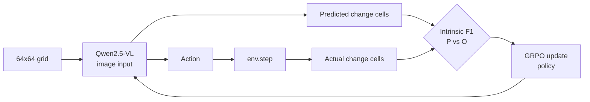
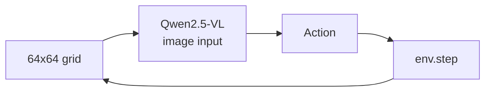
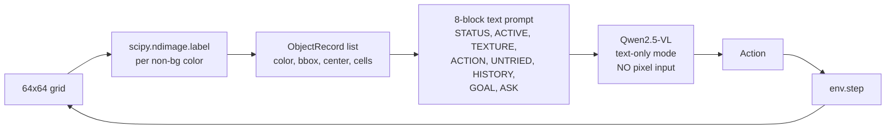
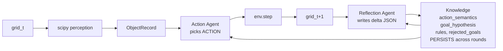
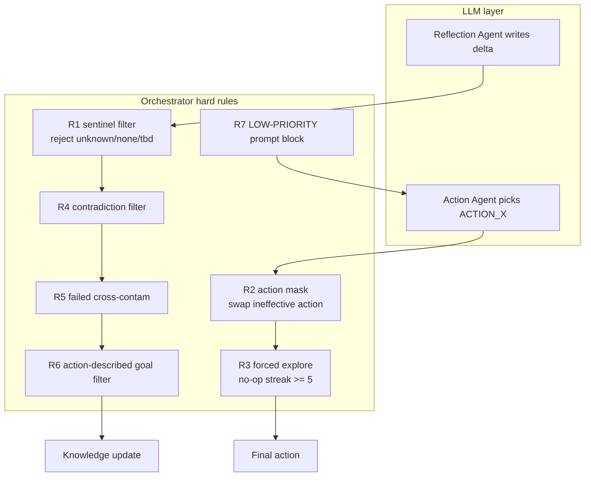
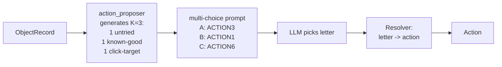
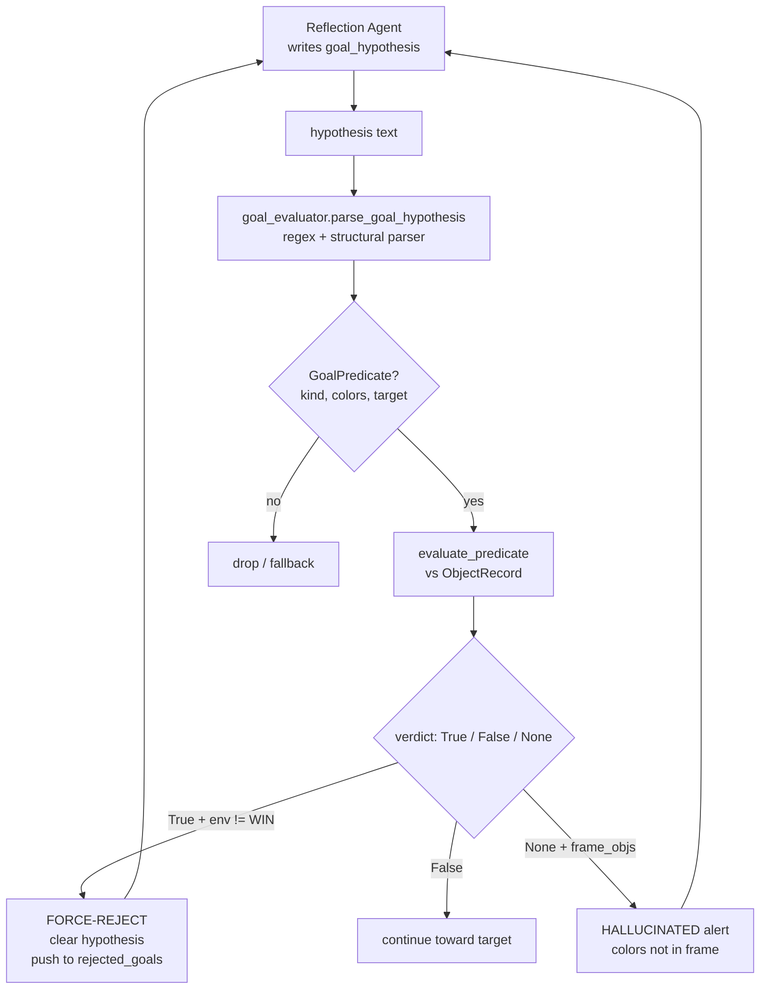
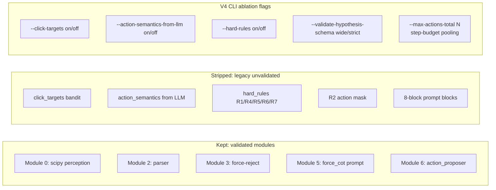

# ARC-AGI-3 Agent — Architecture Evolution

> Each iteration: a diagram, the **reason we changed** (blue), and the **problem it exposed** (red).

---

## v0 — RL with intrinsic F1 reward (parked)

**Reason for this design**: ARC-AGI-3 gives no labels, so no supervised signal exists. Intrinsic F1 between predicted and actual change set is the only dense reward.

**Problem exposed**:
1. Qwen-VL extracted objects at 0% per-frame accuracy on a public game. Predicted change set was noise.
2. No working baseline policy to RL-train on top of.

---

## v1 — VLM with image input + 1-step ablations (parked)

**Reason for this design**: Establish a single-step baseline (random / Claude API / VLM) before any structure.

**Problem exposed**: VLM cannot name cell positions reliably from the 64x64 image. Instructions like "click on (x, y)" produced garbage. Same root as v0.

---

## v3 — scipy perception + text-only Qwen

**Reason for this design**:
- Benchmark showed scipy 100% vs Qwen-VL 0% on the same object-extraction task.
- Make vision deterministic; let LLM only do reasoning. Connect them via structured `ObjectRecord` data. The LLM never sees pixels.

**Problem exposed**:
1. Single-agent loop wrote no persistent learning; every new round forgot what was tested.
2. High no-op rate, ACTION1 spam across multi-step games.

---

## v3.2 — Action Agent + Reflection Agent + persistent Knowledge

**Reason for this design**:
- Persistent learning across rounds — Reflection writes; next round Action reads.
- Specialise the two agents — Action picks, Reflection learns.

**Problem exposed**: LLMs ignored advisory prompt language. "Do not write `unknown` as goal" → it still did. "Do not pick ACTION1 if it was no-op last 3 times" → it still did. This forced the next layer — orchestrator-level hard rules.

---

## v3.2 + R1-R7 hard rules

**Reason for this design**: "Prompt only advises; orchestrator enforces". Hard rules rewrite or filter LLM output, not just request behaviour.

**Problem exposed**:
1. Production change_rate stayed 5-8% on main with all 7 rules on.
2. No individual ablation: we did not know which rule was load-bearing.

---

## v3.2 + action_proposer K=3 candidates

**Reason for this design**: force the LLM to explore by hiding ACTION1 from the default pick. The model can no longer anchor on "first in legal list".

**Problem exposed**:
1. ar25 change_rate jumped 23-17-17% to 60-70-75% (good).
2. But still 0 wins. change_rate measures "frame moved", not "moved toward win".

---

## det_goal v1 / v2 / v3 (parser + force-reject mechanism)

**Reason for this design**:
- Goal recognition needs to be deterministic — synthetic bench showed LLM scored only 30-35% on "is the hypothesis achieved?" while a Python parser scored 83% with 1.25M× speed and 100% recall on TRUE cases (vs LLM 22%).
- When the agent thinks the goal is met but env disagrees, reject the hypothesis. This is the only loop that can self-correct when the LLM hallucinates.

**Problems exposed across iterations**:
- v1: Reflection token budget (250) truncated the JSON output before it could emit a hypothesis. Empty deltas, nothing stored.
- v2: parser vocab too narrow — Reflection wrote "to top edge" and "to the center", but parser only recognised "in column 0" / "vertically aligned".
- v3: Reflection now favours "match X with Y" dialect (under `/no_think` mode) — parser sees this as `align_any` with no direction target.

---

## v4 clean_baseline (current)

**Reason for this design**:
- Methodology reset — every legacy module was kept just by inertia; we never knew which was carrying load and which was dead weight.
- CLI flags allow single-module ablation so we can re-validate.

**5-phase ablation result**:

| Configuration | change_rate (ar25 100 steps) | ACTION1 share | Verdict |
|---|---:|---:|---|
| V4 baseline (all off) | 11% | 94% | reference |
| V4 + click_targets | 11% | 92% | NEUTRAL |
| **V4 + action_proposer** | **86%** | **20%** | **CRITICAL (+75pp)** |
| V4 + action_semantics | 11% | 94% | NEUTRAL |
| V4 + hard_rules | 11% | 94% | NEUTRAL |

5-game V4 + propose: **mean 82% change_rate, 0 / 5 wins**.

**Problems exposed by per-module re-validation**:
- BUG-1 (fatal): 0 / 794 Phase 4 steps had a directional hypothesis — Reflection wrote `match X with Y` instead of `move_to_row N`, so Action had no direction signal.
- BUG-2 (severe): 49% of steps reasoning ≠ action — model wrote "I pick ACTION1" but output `choice: A` which mapped to ACTION3. Pure LLM letter-mapping confusion; orchestrator override contributed 0 of 318 mismatches.
- BUG-3 (methodology root): bench-vs-production distribution shift — bench used sanitized inputs (fixed letter mapping, pre-written hypotheses); production used dynamic shuffle + free output. The 6 bench-PASS modules were not actually validated for production.

---

## What we kept across all iterations

- `scipy.ndimage.label` perception. **Reason kept: 100% vs VLM 0%.**
- `Knowledge` persistence across rounds. **Reason kept: single-round agent forgot every observation.**
- Text-only LLM (no pixel input to model). **Reason kept: structured data is what the model can actually parse.**

## What we tried and dropped

- VLM image input (v0, v1) — replaced after 0% extraction benchmark.
- `/think` mode in production (det_goal v1) — chain never closed in long prompts.
- click_targets bandit standalone — 0 / 5 production hit rate in cross-validation.
- action_semantics from LLM standalone — +0pp on its own in the ablation.
- Hard rules R1/R4/R5/R6/R7 in V4 baseline — +0pp on their own when proposer is the carrier.

## Reading order for new collaborators

1. `presentation/report.md` — current state, why no BFS/DFS, RL plan, results.
2. `presentation/arc.md` — this file.
3. The repository README at the top level.
