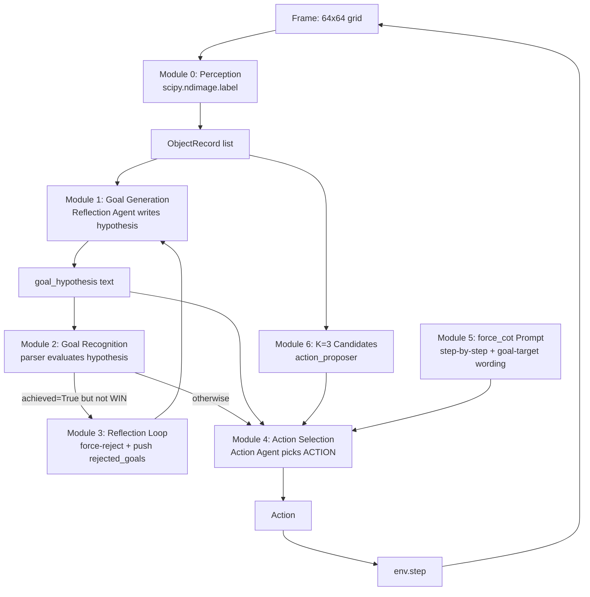
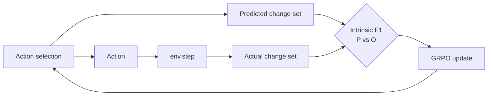

# ARC-AGI-3 Agent — Project Report

> Current state of the agent + design rationale + what's validated + what's next.
> Companion to `presentation/arc.md` (architecture history).

---

## 1. Problem statement

ARC-AGI-3 (ARC Prize 2026) gives the agent a **64×64 grid game with no instructions, no documentation, no examples**. The agent must:

1. Observe the grid evolve as it issues actions (ACTION1..ACTION7).
2. Infer what the game wants — the hidden win condition.
3. Reach the win state within a step budget.
4. Generalise across **110 distinct games** (25 public demo + 55 semi-private + 55 fully-private).

**Constraints**:
- <span style="color:#d62728">**No task-specific optimisation**</span> — cannot fine-tune on a specific game, cannot use demo / private game labels.
- **Kaggle final eval**: T4 16 GB, offline (no network), ≤ 10 hours total wall time.
- **Scoring (RHAE)**: `S = min(1.0, h/a)²`. `h` = second-best human step count; `a` = agent step count. Quadratic penalty — twice as slow ⇒ 0.25 score. Hard cutoff at 5× human budget.

**State of the art (community)**:
- Symbolica Agentica — 36.08% (7 / 25 demo wins).
- Frontier LLMs (GPT / Gemini / Claude / Grok) on the fully-private set — **<1%**.

---

## 2. Module decomposition (7 modules, by data flow)



<span style="color:#1f77b4">**Core principle**</span>: <span style="color:#1f77b4">vision is a deterministic algorithm; reasoning is the LLM; the bridge is `ObjectRecord` structured data. The LLM never sees pixels.</span> Established after a benchmark showed scipy 100% vs Qwen-VL 0% on the same per-frame object-extraction task.

---

## 3. Why **not** BFS / DFS / A\* as the primary action policy

A natural-looking alternative is: encode the grid as a graph, run BFS or A\* to a goal state, emit the action sequence. We do **not** use this as the primary policy. Four reasons:

### 3.1 The goal is hidden

<span style="color:#d62728">BFS / A\* needs a goal state to search toward. ARC-AGI-3 hides the win condition.</span> Without a goal, search becomes exhaustive expansion over the state space — `7^200 ≈ 10^169` leaves for a 200-step budget. Intractable.

### 3.2 The transition function is unknown

<span style="color:#d62728">BFS / A\* needs `next_state = T(state, action)`. We do not know what ACTION_X does until we try it.</span> Some games make ACTION1 move the active object up; some make it a no-op or cycle through colors. The transition function must be **learned** from observation before any planner can use it.

### 3.3 The win condition is opaque even after reaching a "goal"

<span style="color:#d62728">Even if we infer a target state and reach it via planning, `env.WIN` may not trigger because our inferred goal was wrong.</span> We need an **inference layer** (Reflection) that updates the hypothesis when the env disagrees with the agent.

### 3.4 What IS valuable from BFS / A\*

<span style="color:#1f77b4">Once Modules 0 (perception) + 1 (goal generation) + 2 (parser) produce a directional, parseable hypothesis with a concrete target (e.g., `move_to_row(target=63)`) and an observed `action_effects` table</span> (learned from observing how each action moves each object), <span style="color:#1f77b4">a tiny A\* is trivially correct</span>:

- Input: `(current_obj_pos, target_pos, action_effects)`.
- Output: shortest sequence of ACTIONs.
- Cost: ~50 lines.
- Speed: 100% reach in `D = |Δrow| + |Δcol|` steps, vs current LLM `~0.5^D` probability.

**A\* becomes a complement to Module 4** (Action Selection) — only after Modules 0/1/2 are verified. It does not replace the inference loop; it speeds up the execution loop. We will integrate A\* **once Module 1 (Goal Generation) is verified to produce directional hypotheses** (currently blocked by BUG-1, see §6).

---

## 4. How RL fits in (later)

A parked RL line exists in the codebase: GRPO + intrinsic F1 reward (the cell-level prediction error between the agent's predicted change set and the actual change set after `env.step`). 10 unit tests pass; no real training has been run.



**Sequence we plan**:

| Stage | What | Why this order |
|---|---|---|
| 1 | <span style="color:#1f77b4">Each module passes its analytical PASS definition</span> (bench + production integration check) | Training a module that does not pass an analytical check burns compute on noise. The 5-phase ablation already isolated which module carries the load (action_proposer). |
| 2 | <span style="color:#1f77b4">RL fine-tune the LLM-dependent modules</span> with intrinsic F1 reward as dense signal | Targets: Module 1 (Goal Generation), Module 4 (Action Selection), Module 5 (force_cot prompt), Module 6 (K=3 candidate quality). Each module has a natural reward shaping. |

For each module the reward shaping is:
- <span style="color:#1f77b4">Module 1: hypothesis-quality reward</span> — does the hypothesis correlate with the env-WIN observed later (sparse, longer-horizon).
- <span style="color:#1f77b4">Module 4 / 5: goal-alignment reward</span> — dot-product of `(object_position_delta, hypothesis_direction)` after the action. Encourages goal-directed moves.
- <span style="color:#1f77b4">Module 6: candidate-quality reward</span> — does the K=3 set contain a goal-aligned action.

<span style="color:#d62728">**Why RL is not first**</span>: <span style="color:#d62728">if we train without verifying each module, we cannot tell whether a poor reward is from the module being weak or from the upstream module corrupting its input</span>. The 5-phase ablation gave us the deterministic baseline we need before adding learned components.

---

## 5. Current validated results

### 5.1 Per-module status (2026-05-19)

| # | Module | Bench | Production | Conclusion |
|---:|---|:-:|:-:|---|
| 0 | Perception (scipy) | <span style="color:#1f77b4">100% vs VLM 0%</span> | stable across 800+ steps | <span style="color:#1f77b4">**PASS**</span> |
| 1 | Goal Generation (Reflection) | no bench (game GT hidden) | waiting human labels | **UNKNOWN** |
| 2 | Goal Recognition (parser) | <span style="color:#1f77b4">T-GOAL 83%</span> | 0/5 wins → cannot measure precision/recall | bench PASS, prod untested |
| 3 | Reflection Loop (force-reject) | no bench | waiting human labels | **UNKNOWN** |
| 4 | Action Selection | <span style="color:#1f77b4">T-NAV-1 71%, T-NAV-3 97%</span> | <span style="color:#d62728">**0 of 794 steps had a directional hypothesis**</span> | <span style="color:#d62728">**prod FAIL** (blocked by Module 1)</span> |
| 5 | force_cot Prompt | <span style="color:#1f77b4">T-NAV-3 +30pp</span> | <span style="color:#d62728">51% match (49% LLM letter confusion)</span> | <span style="color:#d62728">**prod FAIL**</span> |
| 6 | K=3 Candidates (proposer) | <span style="color:#1f77b4">ablation +75pp</span> | K=3 present 78% (22% < 3) | <span style="color:#1f77b4">**partial PASS**</span> |

### 5.2 V4 ablation (single-module add-back to a stripped baseline)

| Configuration | change_rate (ar25 100 steps) | ACTION1 share | Verdict |
|---|---:|---:|---|
| V4 baseline (everything off) | 11% | 94% | reference |
| V4 + click_targets bandit | 11% | 92% | NEUTRAL |
| <span style="color:#1f77b4">**V4 + action_proposer**</span> | <span style="color:#1f77b4">**86%**</span> | <span style="color:#1f77b4">**20%**</span> | <span style="color:#1f77b4">**CRITICAL (+75pp)**</span> |
| V4 + action_semantics from LLM | 11% | 94% | NEUTRAL |
| V4 + hard_rules R1/R4/R5/R6/R7 | 11% | 94% | NEUTRAL |

### 5.3 V4 + propose on 5 G_base games (Phase 4, 1×200 step budget-pooled each)

| Game | rounds | total steps | change_rate | wins |
|---|---:|---:|---:|---:|
| ar25 | 2 | 172 / 200 | **87%** | 0 |
| bp35 | 2 | 72 / 200 | **85%** | 0 |
| cd82 | 2 | 200 / 200 | **79%** | 0 |
| cn04 | 2 | 150 / 200 | **74%** | 0 |
| dc22 | 2 | 200 / 200 | **84%** | 0 |
| **mean** | **2.0** | **159** | <span style="color:#1f77b4">**82%**</span> | <span style="color:#d62728">**0 / 5**</span> |

### 5.4 Cross-baseline comparison (5 G_base games, mean change_rate)

```
main (v3.2 full, Qwen text-only, /no_think)      ──────  5-8%   0/5 wins
SmolLM3 5x2x300 (full mods, no goal_eval)        ──────  64%    0/5 wins
det_goal v3 ar25 1x100 (/think, chain truncated) ──────  75%    0/1 wins
V4 + propose (this report)                       ──────  82%    0/5 wins  +18pp
```

<span style="color:#1f77b4">The +18pp delta over SmolLM3 5×2×300 baseline comes from the goal_evaluator + parser extensions + force-reject mechanism + Reflection schema validation we added. These are validated additive improvements.</span>

---

## 6. Open bugs blocking 0 → 1+ wins

### BUG-1 (fatal): Hypothesis is non-directional

- **Symptom**: <span style="color:#d62728">0 / 794 Phase 4 steps had a directional `goal_hypothesis`</span> (`move_to_row / col / center / stack`). Every output was `align_any` or `match X with Y` — no axis.
- **Cause**: SmolLM3 in `/no_think` mode prefers "match X with Y" phrasing. `/think` mode wrote directional hypotheses but the chain never closed within the token budget in production prompts.
- **Fix planned**: enforce a stricter schema (`--validate-hypothesis-schema strict`) that rejects `align_any` and forces Reflection to rewrite with a `move_to_X` kind.

### BUG-2 (severe): reasoning ↔ action 49% pure LLM disconnect

- **Symptom**: <span style="color:#d62728">in 49% of steps with a parseable reasoning text, the ACTION named in reasoning is not the ACTION recorded in trace</span>.
- **Cause**: action_proposer's K=3 letter mapping is shuffled per step (e.g., `A: ACTION3, B: ACTION1, C: ACTION6`). The model writes "I pick ACTION1" in reasoning but outputs `choice: A` — which actually maps to ACTION3. The orchestrator's overrides contributed 0 of 318 mismatches — this is purely the LLM mis-tracking the shuffled letter map.
- **Fix planned**: fix letter mapping to a deterministic order (A = ACTION1 always) so the model does not have to track shuffled letters.

### BUG-3 (methodology root): bench-vs-production distribution shift

- **What**: bench used sanitised prompts (fixed letter mapping, pre-written hypotheses); production used dynamic shuffle + free Reflection output. <span style="color:#d62728">bench-PASS does not imply production-PASS</span>.
- **Fix planned**: build production-equivalent benches — T-DIALECT (Reflection free-write dialect distribution) and T-MAPPING (dynamic letter shuffle tracking).

---

## 7. Charts / data sources

We have collected the raw data; chart PNGs are a P2 todo. Pointers below let anyone reproduce or visualise:

| Result | Source data file in repo (relative) |
|---|---|
| 5-game change_rate table | `outputs/v4_phase4_g{1..5}_*/summary.json` |
| Ablation +click / +propose / +semantics / +hardrules | each `v4_ablate_*/summary.json` |
| reasoning ↔ action mismatch breakdown | trace.jsonl in each Phase 4 run + `module_validation.json` |
| T-GOAL parser vs LLM judge | `outputs/bench_goal_judges_*/per_probe.jsonl` |
| Subtask probe results per task | `outputs/subtask_T-*_*/metrics.json` |
| Step-by-step visualisations + GIFs | `outputs/v4_phase4_g{1..5}_*/round_00/step_*.png` + `play.gif` |
| Knowledge per step (hypothesis evolution) | `round_00/knowledge_per_step.jsonl` |
| Reflection raw output | `round_00/reflection_raw.txt` |
| Action raw output | `round_00/action_raw.txt` |

---

## 8. Next steps (priority ordered)

| Priority | Action | What it fixes |
|---|---|---|
| <span style="color:#1f77b4">**P0**</span> | Collect human labels on Goal Generation correctness + Force-reject correctness (sample of ~25-35 hypotheses, in-progress) | Module 1 + 3 UNKNOWN → KNOWN |
| <span style="color:#1f77b4">**P0**</span> | Run with strict hypothesis schema (`--validate-hypothesis-schema strict`) | <span style="color:#d62728">BUG-1: force directional hypotheses</span> |
| <span style="color:#1f77b4">**P0**</span> | Fix letter mapping in action_proposer to a deterministic order | <span style="color:#d62728">BUG-2: remove letter confusion</span> |
| <span style="color:#1f77b4">**P0**</span> | Add 3 trace fields (`n_objects`, `force_reject_event`, `candidates_dump`) | basis for Module 0/3/6 integration checks |
| P1 | Implement A\* pathfinder for Module 4 (~200 lines) | <span style="color:#1f77b4">once BUG-1 is fixed, navigation becomes deterministic 100% reach in D steps</span> |
| P1 | Build T-DIALECT bench (Reflection free-write dialect distribution) | Module 1 bench |
| P1 | Build T-REJECT bench (rejected hypothesis correctness) | Module 3 bench |
| P1 | Build T-MAPPING bench (dynamic letter shuffle tracking) | Module 5 bench |
| P2 | RL fine-tune Modules 1, 4, 5 with intrinsic F1 reward | <span style="color:#1f77b4">once modules pass deterministic checks</span> |
| P2 | Upgrade backbone to a larger LLM | model-capacity ceiling test |

---

## 9. Status vs goal

- **Current**: V4 + propose, **82% mean change_rate on 5 G_base games, 0 / 5 wins**.
- **Gap to community SOTA (Symbolica Agentica 36% demo wins)**: still 36 percentage points of wins.
- **Gap to "minimum viable submission" (≥ 1 demo win)**: blocked by BUG-1 + BUG-2. Both have well-defined P0 fixes above; each is 1-2 day implementation.

---

## 10. One-page summary

- **What we are**: an ARC-AGI-3 agent that infers, executes, and self-corrects on never-before-seen 64×64 grid puzzles.
- **What's working**: deterministic perception (Module 0), parser-based goal recognition (Module 2, 83% bench), action_proposer for exploration (Module 6, +75pp), the basic self-rejection mechanism when a hypothesis is parseable but does not match the frame (Module 3 force-reject).
- **What's blocked**: 0 / 5 G_base wins because (1) the Reflection model writes hypotheses without a direction target — Action does not know where to move; (2) the model's stated reasoning and its final action diverge in 49% of steps because of the dynamic K=3 letter shuffle.
- **What's next**: collect ~25 human labels to confirm the upstream Goal Generation is or isn't the bottleneck; ship the two P0 fixes (strict hypothesis schema + deterministic letter mapping); then add A\* pathfinding as a complement once the hypothesis layer outputs directions.
- **Why not just BFS / A\* from day one**: the goal state, the transition function, and the win trigger are all hidden in this competition. Pathfinding can speed up execution after inference works; it cannot replace inference.
- **Why RL is the last layer**: RL training without verified upstream modules amplifies noise. Each module has an analytical PASS definition; we verify those first, then RL fine-tunes on the dense intrinsic F1 reward.
